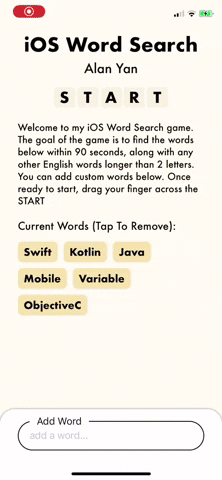
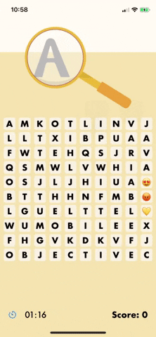
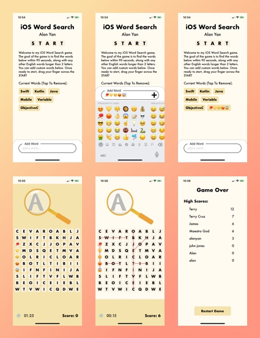

# iOS-Word-Search

A word search, where the goal is to find the most words in 90 seconds, from words randomly generated along with words that can be set by the user. Developed using Swift 5.1 and Xcode

## Premise

The goal of the game is to find the words on the Start Screen within 90 seconds, along with as many other English words longer than 2 letters as possible.

## Features

- Support for user added words, up to 10 words
- Randomly generates other words in the English dictionary
- Supports user adding Emoji words
- Draws lines over found words
- Clean UI Animations
- Allows dragging over tiles to select them
- Provides Haptic Feedback
- Persisted High Score On Device
- Autolayout Portrait Device iPhone SE - iPhone 11 Pro Max

## UI Display

 

## Screenshots

## Play Instructions

 1) Clone
 2) Open Xcode Project
 3) Build and Run either on a device or in simulator (haptic feedback only on real device)
